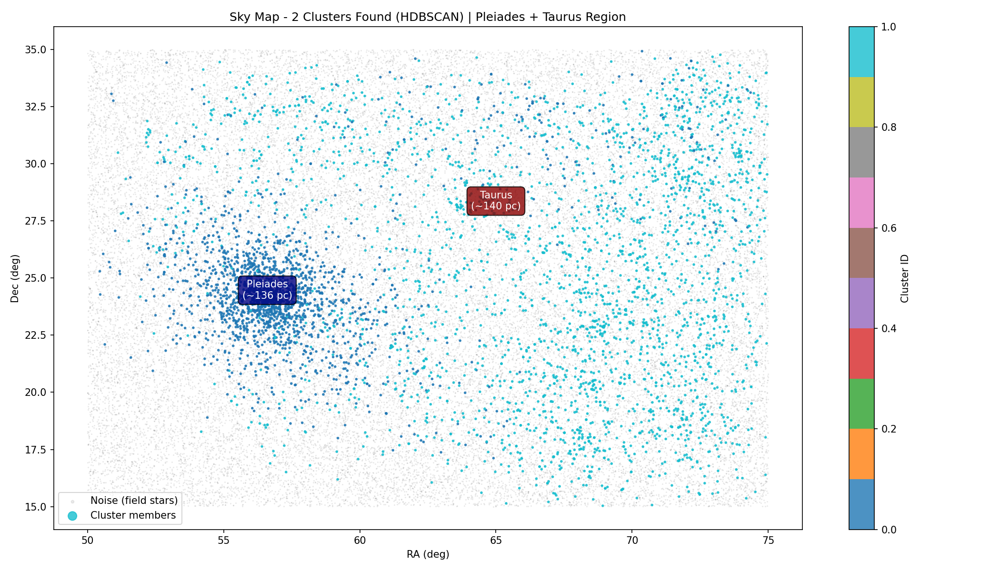
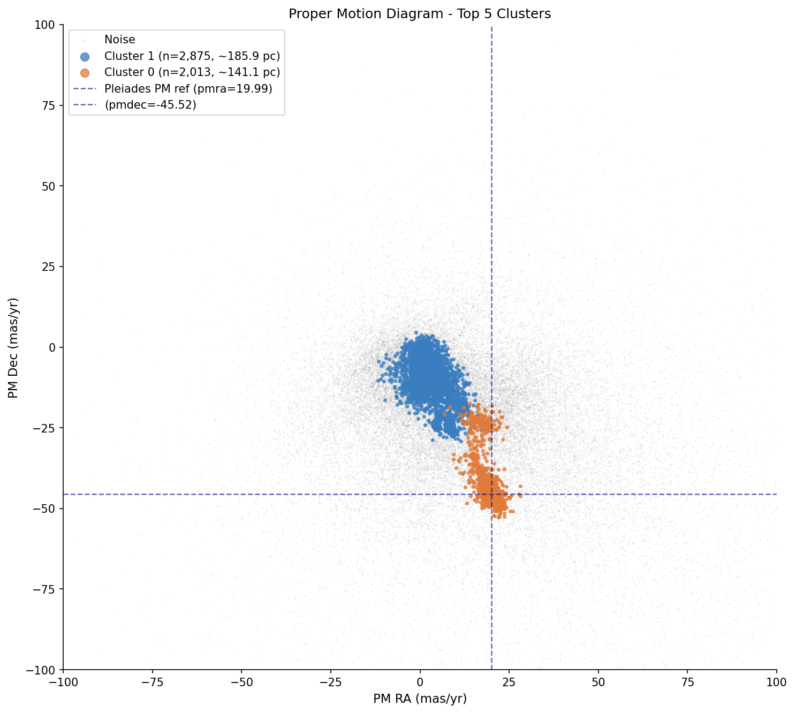
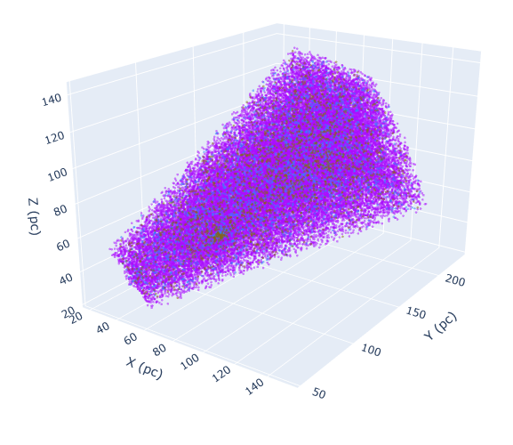

# Gaia DR3 — Star Cluster Discovery: Pleiades + Taurus

[](https://www.python.org/)
[](https://opensource.org/licenses/Apache-2.0)
[](https://gea.esac.esa.int/archive/)

Proyek ini menggunakan data astrometri dan fotometri dari **Gaia DR3** untuk mengidentifikasi gugus bintang terbuka di wilayah **Pleiades (M45)** dan **Taurus** menggunakan algoritma clustering **HDBSCAN**.

## Tujuan

- Mengunduh data bintang dari Gaia DR3 dalam wilayah RA 50° - 75° dan Dec 15° - 35°.
- Mengubah koordinat langit (RA, Dec, Parallax) menjadi posisi Kartesian 3D (X, Y, Z) dalam parsec.
- Menggunakan proper motion (`pmra`, `pmdec`) dan posisi 3D untuk mengelompokkan bintang-bintang yang memiliki gerak dan jarak serupa.
- Mengidentifikasi gugus **Pleiades** dan **Taurus** secara otomatis berdasarkan posisi langit dan jarak.
- Menyajikan visualisasi: peta langit, diagram proper motion, dan peta 3D interaktif.

## Metode

| Tahap        | Deskripsi                                                                                                   |
| ------------ | ----------------------------------------------------------------------------------------------------------- |
| Query        | Menggunakan `astroquery.gaia` dengan filter parallax 4–12 mas, parallax_over_error > 5                   |
| Transformasi | Konversi (RA, Dec, parallax) -> (X, Y, Z) dalam parsec                                                      |
| Fitur        | `x`, `y`, `z`, `pmra`, `pmdec`                                                                    |
| Scaling      | `RobustScaler` (tahan outlier)                                                                            |
| Clustering   | `HDBSCAN` (min_cluster_size=80, min_samples=15, epsilon=0.3)                                              |
| Evaluasi     | Silhouette Score (untuk cluster non-noise)                                                                  |
| Identifikasi | Pencocokan posisi langit dengan Pleiades (`RA~56.6°, Dec~24.1°`) dan Taurus (`RA~65.0°, Dec~28.0°`) |

## Hasil yang Diharapkan

- Peta langit (RA vs Dec) dengan warna berdasarkan cluster ID.
- Diagram proper motion untuk 5 cluster terbesar.
- Visualisasi 3D interaktif (X, Y, Z) menggunakan Plotly (`clusters_3d.html`).
- Ringkasan cluster: jumlah bintang, rata-rata RA/Dec/parallax/jarak/pmra/pmdec/magnitudo.
- Deteksi otomatis cluster Pleiades dan Taurus.

## Output Files

| File                                                  | Deskripsi                              |
| ----------------------------------------------------- | -------------------------------------- |
| [`eda_distributions.png`](media/eda_distributions.png) | Histogram distribusi tiap fitur        |
| [`eda_sky.png`](media/eda_sky.png)                     | Peta langit awal dengan warna parallax |
| [`clusters_sky.png`](media/clusters_sky.png)           | Peta langit hasil clustering           |
| [`clusters_pm.png`](media/clusters_pm.png)             | Diagram proper motion                  |
| [`clusters_3d.html`](media/clusters_3d.html)           | Peta 3D interaktif (buka di browser)   |

## Cara Menjalankan

### 1. Install dependensi

```bash
pip install -r requirements.txt
```

### 2. Jalankan script

```bash
git clone https://github.com/FauzanFR/gaia-pleiades-taurus-clusters
cd gaia-pleiades-taurus-clusters
python gaia_pleiades_taurus.py
```

`* atau bisa menggunakan ipynb yang disediakan`

Catatan: Query ke Gaia DR3 membutuhkan koneksi internet dan dapat memakan waktu beberapa menit tergantung jumlah data.

## Contoh Parameter HDBSCAN

```python
HDBSCAN(
    min_cluster_size=80,
    min_samples=15,
    cluster_selection_epsilon=0.3,
    metric='euclidean',
    cluster_selection_method='eom'
)
```

Parameter ini dipilih agar:

- Cluster tidak terlalu kecil (≥80 bintang).
- Sensitif terhadap struktur lokal dengan `min_samples=15`.
- `epsilon=0.3` membantu memisahkan cluster yang berdekatan di ruang fitur yang telah diskalakan.

Hasil Visualisasi

### Peta Langit



### Proper Motion Diagram



### 3D Interactive Map



## Referensi

- [Gaia DR3 Documentation](https://gea.esac.esa.int/archive/)
- [HDBSCAN Documentation](https://hdbscan.readthedocs.io/)
- [Astroquery Documentation](https://astroquery.readthedocs.io/)

## Lisensi

Kode ini disediakan untuk keperluan edukasi dan riset gugus bintang terbuka.
